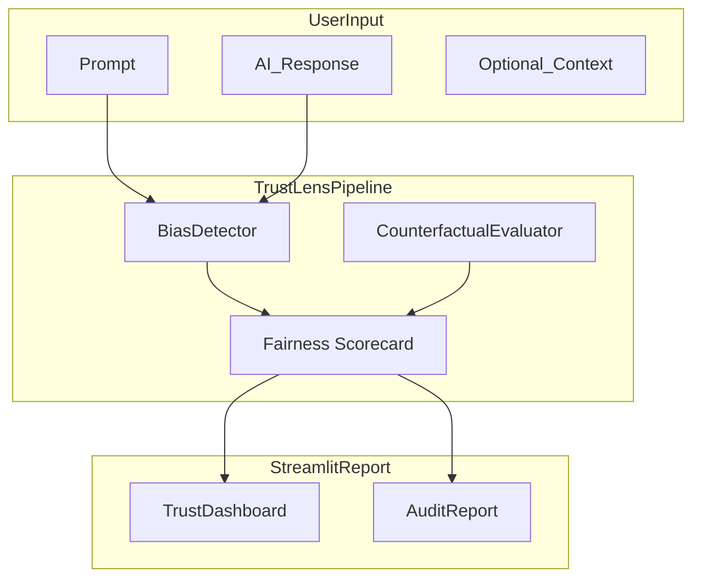

# TrustLens: Tabular Fairness Auditing Platform

Problem to solve: “Can this predictive model make fair decisions across demographic groups?”

TrustLens provides a Streamlit-driven workflow for tabular dataset profiling, bias measurement, fairness mitigation, explainability, and audit reporting.

## Problem

Classification models trained on real-world tabular data can learn unfair patterns that disadvantage protected groups. TrustLens helps detect disparities, compare mitigation strategies, and produce explainable audit outputs.

## Architecture



## Quick start

```bash
# 1. Create virtual environment
python -m venv .venv
.venv\Scripts\activate        # Windows
# source .venv/bin/activate   # macOS/Linux

# 2. Install dependencies
pip install -r requirements.txt

# 3. Run tests
pytest

# 4. Launch the app
streamlit run app/streamlit_app.py
```

## Usage

1. Launch the dashboard with `streamlit run app/streamlit_app.py`.
2. Use the sidebar to select a dataset and protected attribute.
3. Train baseline models from the **Model Training** tab.
4. Review fairness metrics in the **Fairness Scorecard** tab.
5. Compare performance versus fairness in **Tradeoff Analysis**.
6. Apply mitigation methods in **Bias Mitigation**.
7. Inspect feature impact with SHAP in **SHAP Explanations**.
8. Generate an audit PDF from the **Audit Reports** tab.

## Fairness audit workflow

TrustLens is designed for tabular fairness auditing through these steps:

1. Load a dataset and choose a protected attribute.
2. Train baseline models and evaluate standard classification performance.
3. Compute fairness metrics such as statistical parity difference (SPD), disparate impact ratio (DIR), equal opportunity difference (EOD), and equalized odds.
4. Compare model performance against fairness outcomes.
5. Apply mitigation methods and observe how fairness metrics change.
6. Use SHAP explainability to inspect influential features.
7. Generate a PDF audit report summarizing the findings.

## Libraries used
- `xgboost`: tabular model training and evaluation.
- `fairlearn`: fairness-aware mitigation and post-processing.
- `shap`: model explainability and feature attribution.
- `plotly`: interactive dashboard visualizations.
- `reportlab`: PDF report generation.

## Project structure

```
src/trustlens/          Core pipeline modules
app/streamlit_app.py    Streamlit UI
data/benchmarks/        Counterfactual prompt scenarios
data/sample/            Example audit cases
reports/                 Generated PDF reports and chart assets
tests/                  Unit tests
requirements.txt        Python dependencies
pyproject.toml          Project metadata and pytest config
```

## Metrics reference

| Metric | Description |
|--------|-------------|
| **SPD** | Statistical Parity Difference — max minus min positive-framing rate across groups |
| **DIR** | Disparate Impact Ratio — min rate / max rate (80% rule) |
| **Bias score** | Composite toxicity + stereotype + descriptor signals (0–1, lower is better) |
| **Factuality score** | Fraction of claims supported by context (0–1, higher is better) |

## Limitations

- Toxicity models may false-positive on dialect and reclaimed language
- Without source context, open-domain fact-checking is unreliable
- Counterfactual fairness depends on prompt design choices
- Trust scores are **decision-support tools**, not safety certifications

## What I would build next

- RAG-based retrieval for open-domain fact verification

- Optional OpenAI API integration for auto-generating counterfactual responses

- Classical tabular ML fairness track (Adult Census + fairlearn)

- Production monitoring dashboard with audit history

## License

MIT
